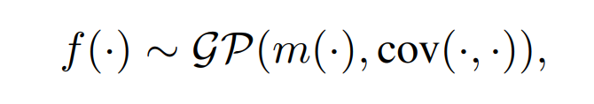
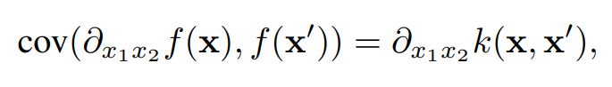
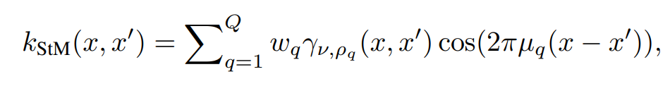
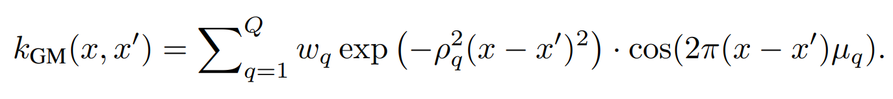

# Gaussian-Process-Slover-for-High-Freq-PDE

**Still under construction, please wait for the official release.**
___

Official implementation of the paper **"Solving High Frequency and Multi-Scale PDEs with Gaussian Processes"** [[OpenReview](https://openreview.net/forum?id=q4AEBLHuA6&referrer=%5BAuthor%20Console%5D(%2Fgroup%3Fid%3DICLR.cc%2F2024%2FConference%2FAuthors%23your-submissions))][[Arxiv](https://arxiv.org/abs/2311.04465)] (ICLR 2024).


---
## Key Idea: 
- Assign a Gaussian Process (GP) prior to the PDE solution $f(\cdot)$, and track its derivative (also a GP) with *kernel   differential trick.*


<div align=center>  </div>

<div align=center>  </div>


- Use *Spectral Mixture Kernel* in the log domian as Jeffreys prior, automatically induce the sparsity and capture the high-frequency components of the solution.
<div align=center>  </div>

<div align=center>  </div>

---
Illustration of the learned solutions of some high-frequency PDEs. 
<div align=center>  </div>
<div align=center>  </div>
<!-- <div align=center>  </div> -->


## Requirements:
The project is mainly built with **Jax** under **python 3.10**. 

## Instructions:
1. Clone this repository.
2. To play with the model quickly, we offer several notebooks at `notebook`(on synthetic & real data)
3. To run the real-world datasets with scripts, see `script_Funbat.sh` and `script_Funbat_CP.sh` for example.
4. To tune the (hyper)parametrs of model, modify the `.yaml` files in `config` folder
5. To apply the model on your own dataset, please follow the [process_script](https://github.com/xuangu-fang/Functional-Bayesian-Tucker-Decomposition/tree/master/data/process_script). or [generating-synthetic-data](data/synthetic/simu_data_generate_CP_r1.ipynb) to process the raw data into appropriate format.
6. GPU choice: the models are run on CPU by default, but you can change the device to GPU by modifying the `device` as `gpu` of `.yaml` files in the `config` folder.


## Data

We offer the [raw data](https://drive.google.com/drive/folders/1DQJFZ9IkKw9pzr_vBSCLnrzqn4dp4kBd?usp=drive_link), [processed scripts](https://github.com/xuangu-fang/Functional-Bayesian-Tucker-Decomposition/tree/master/data/process_script), and processed data([Beijing](https://github.com/xuangu-fang/Functional-Bayesian-Tucker-Decomposition/tree/master/data/beijing),[US-TEMP](https://github.com/xuangu-fang/Functional-Bayesian-Tucker-Decomposition/tree/master/data/US-Temp)) for all four datasets used in paper. The code for generating the synthetic data is also provided in the [data]( https://github.com/xuangu-fang/Functional-Bayesian-Tucker-Decomposition/tree/master/data/synthetic) folder.


If you wanna customize your own data to play the model, please follow the [process_script](https://github.com/xuangu-fang/Functional-Bayesian-Tucker-Decomposition/tree/master/data/process_script).


## Citation


Please cite our work if you would like it
```
@article{fang2023functional,
  title={Functional Bayesian Tucker Decomposition for Continuous-indexed Tensor Data},
  author={Fang, Shikai and Yu, Xin and Wang, Zheng and Li, Shibo and Kirby, Mike and Zhe, Shandian},
  journal={arXiv preprint arXiv:2311.04829},
  year={2023}
}
```

```

to-do-list:
- [ ] 1. clean code
- [ ] 2. re-organize the result-log
- [ ] 4. update arxiv link