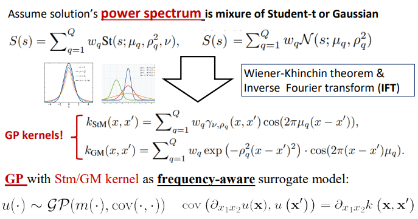
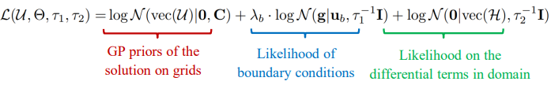
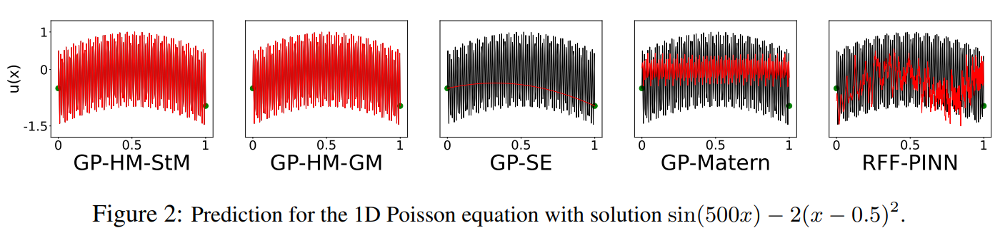
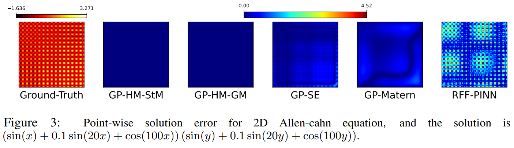
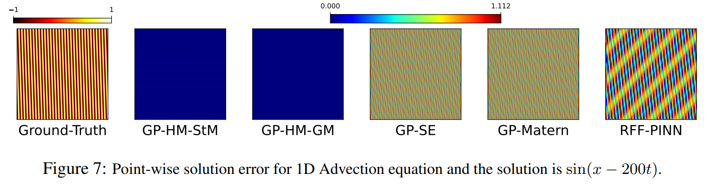

# (ICLR 2024) Gaussian-Process-Slover-for-High-Freq-PDE

<div align=center>  </div>
___

Official implementation of the paper **"Solving High Frequency and Multi-Scale PDEs with Gaussian Processes"** [[OpenReview](https://openreview.net/forum?id=q4AEBLHuA6&referrer=%5BAuthor%20Console%5D(%2Fgroup%3Fid%3DICLR.cc%2F2024%2FConference%2FAuthors%23your-submissions))][[Arxiv](https://arxiv.org/abs/2311.04465)][[知乎](https://zhuanlan.zhihu.com/p/702160584?)] (ICLR 2024), 
by [Shikai Fang*](https://users.cs.utah.edu/~shikai/), [Madison Cooley*](https://users.cs.utah.edu/~mcooley/), [Da Long*](https://scholar.google.com/citations?user=UIY-EDEAAAAJ), [Shibo Li](https://imshibo.com/), [Robert Kirby](https://www.cs.utah.edu/~kirby/), [Shandian Zhe](https://www.cs.utah.edu/~kirby/). (*:equal contribution)


---
## Key Idea: 
- model the PDE solution in **frequency domain** using *Gaussian Processes(GP)*.


<div align=center>  </div>


- Efficient Inference by maximizing log-joint prob over *structured kernels*:

<div align=center>  </div>


---
Illustration of the learned solutions of some high-frequency PDEs. 
<div align=center>  </div>
<div align=center>  </div>
<!-- <div align=center>  </div> -->


## Requirements:
The project is mainly built with **Jax 0.4.8** under **python 3.10**. See detailed info of packages in `requirements.txt`.

## Instructions:
1. Clone this repository.
2. Install the required packages by running `pip install -r requirements.txt`.
3. Run the solvers for the 1d and 2d PDEs bu running the following scripts in the terminal:
    - 1d PDEs: `. run_1d.sh`
    - 2d PDEs: `. run_2d.sh`
4. Detailed explanations on the PDEs and kernels are provided in the scripts.There are 4 kernels available: 
    - "Matern52_Cos_1d"--->GP-HM-Stm
    - "SE_Cos_1d"--->GP-HM-GM
    - "Matern52_1d"--->GP-Matern
    - "SE_1d"--->GP-SE
5. Hyperparameters of each PDE can be tuned in the `.yaml` file in the `config` folder. The current hyperparameters are the best ones we found for each PDEs.
6. To apply the solver to other PDEs, you can modify the `equation_dict` variable in the `model_GP_solver_1d.py` and `model_GP_solver_2d.py` files.


## Citation

Please cite our work if you would like it
```
@inproceedings{fang2024solving,
      title={Solving High Frequency and Multi-Scale PDEs with Gaussian Processes}, 
      author={Shikai Fang and Madison Cooley and Da Long and Shibo Li and Robert Kirby and Shandian Zhe},
      booktitle={International Conference on Learning Representation},
      year={2024}
}
```


